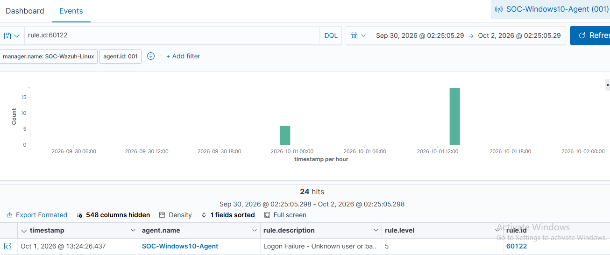
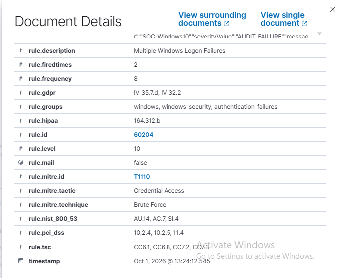
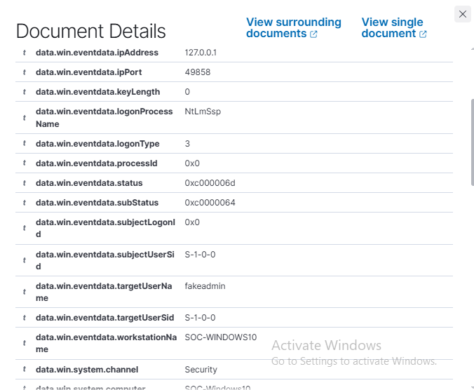
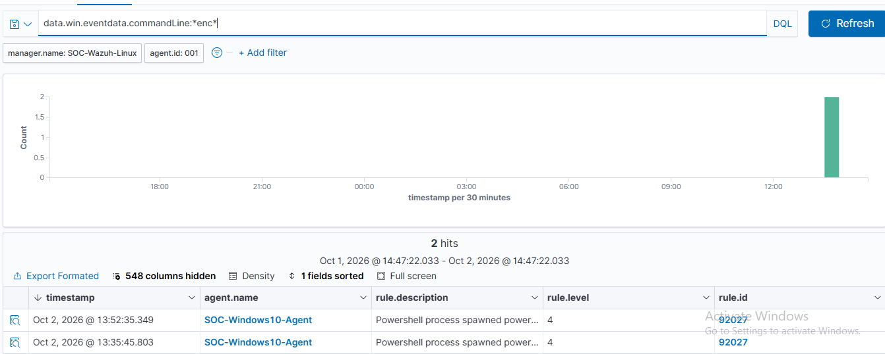
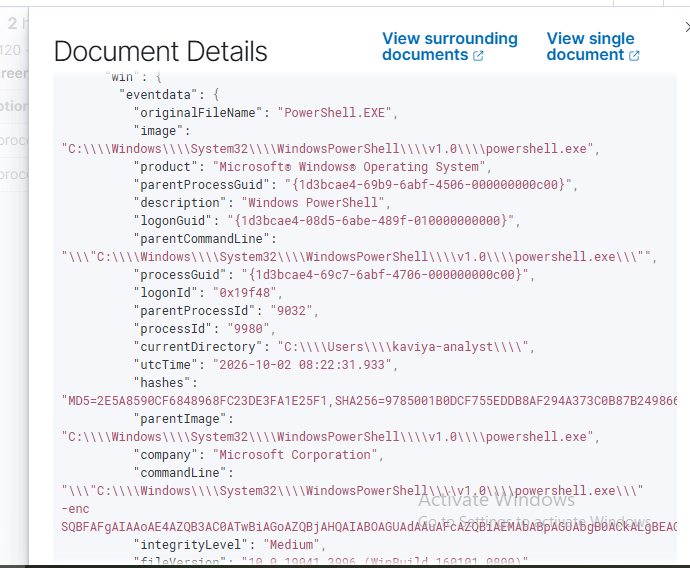
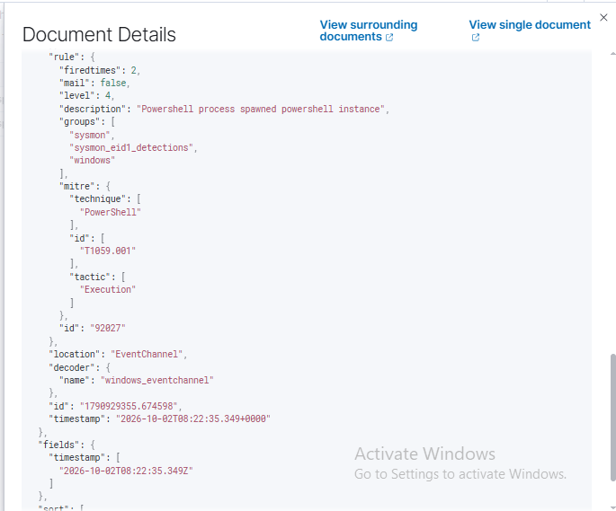
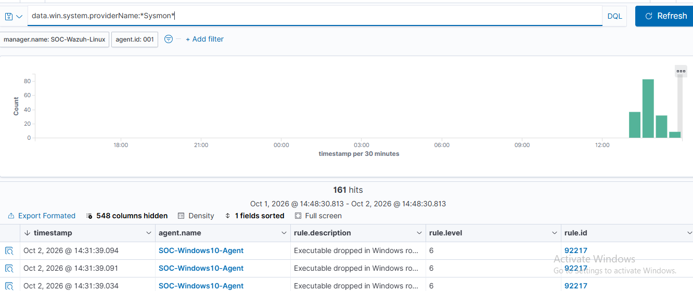

# SIEM / SOC Monitoring Lab (Wazuh + Sysmon)

A home SOC lab where I collected Windows endpoint logs in a SIEM, simulated two suspicious behaviours, detected them, and wrote incident reports. Everything ran on my own virtual machines. No real or public systems were tested.

## Objective
Build a working SOC monitoring pipeline and practise the analyst workflow: generate activity, find it in the SIEM, triage the alert, map it to MITRE ATT&CK, and document it.

## Architecture
```
Windows 10 VM (Sysmon + Wazuh agent)  -->  Ubuntu VM (Wazuh manager + indexer + dashboard)
        192.168.56.101                              192.168.56.102
                     (VirtualBox host-only network)
```
The dashboard is reached from the host machine's browser through a VirtualBox port forward.

## Tools used
| Tool | Purpose |
|---|---|
| VirtualBox | Virtualisation |
| Windows 10 | Monitored endpoint |
| Sysmon (SwiftOnSecurity config) | Detailed Windows process and network logging |
| Ubuntu Server 24.04 | SIEM server |
| Wazuh 4.9.2 | SIEM: manager, indexer and dashboard |

## Setup summary
1. Built two VMs on a VirtualBox host-only network so they could talk to each other.
2. Installed the Wazuh all-in-one stack on the Ubuntu VM.
3. Installed Sysmon and the Wazuh agent on the Windows VM and registered the agent with the manager.
4. Confirmed that Windows event logs from the agent reached the manager and dashboard, with alerts mapped to MITRE ATT&CK. Sysmon logs were connected later (see "Detection gap found and fixed").
5. Took VM snapshots so the lab can be restored.

## Scenarios investigated
| # | Scenario | Rule | Level | MITRE ATT&CK | Report |
|---|---|---|---|---|---|
| 1 | Burst of failed logins (simulated brute force) | 60122, 60204 | 5, 10 | T1110 Brute Force | [Incident Report 1](incident-report-1-failed-logon.md) |
| 2 | Encoded, hidden PowerShell download attempt | 92027 | 4 | T1059.001 PowerShell | [Incident Report 2](incident-report-2-powershell.md) |

### Scenario 1: failed logins
I ran 20 failed network logins against a user that does not exist. Wazuh raised one level-5 alert per failure, then escalated to a level-10 "Multiple Windows Logon Failures" alert after 8 failures.





### Scenario 2: encoded PowerShell
I ran a Base64-encoded PowerShell command that downloads content from a website and tries to execute it, a common attacker technique. Wazuh detected it as a PowerShell process spawning another PowerShell instance.





## Detection gap found and fixed
My first PowerShell test did not appear in Wazuh. I traced it step by step:
1. Confirmed in Windows Event Viewer that the command had run.
2. Searched Wazuh for Sysmon process-creation events (Event ID 1) and found none. A search of the agent's `ossec.conf` also showed no Sysmon log source configured.
3. Backed up the agent's `ossec.conf`, added the Sysmon log source, and restarted the agent.
4. Sysmon events started arriving, and the PowerShell alerts appeared.



## MITRE ATT&CK mapping
| Technique | Tactic | Seen in |
|---|---|---|
| T1110 Brute Force | Credential Access | Scenario 1 |
| T1059.001 PowerShell | Execution | Scenario 2 |

## Lessons learned
- Always verify that a log source is actually reaching the SIEM. A missing source looks the same as "nothing happened".
- Back up a configuration file before editing it.
- Wazuh level numbers are a starting point, not a verdict. The encoded PowerShell command was only level 4, which I would want to raise with a custom rule.
- Clock differences matter. Wazuh displays local browser time but stores UTC, so I recorded the UTC time alongside the local time in Incident Report 2.

## Limitations
- Two VMs only, with self-generated test activity, so this is not production scale.
- Both scenarios were simulated, so there is no real attacker behaviour to analyse.
- No custom detection rules or automated response yet.

## Possible next steps
- Write a custom Wazuh rule to raise the severity of encoded PowerShell.
- Add a second endpoint and a Linux agent.
- Build a dashboard for failed logins and top source IPs.
